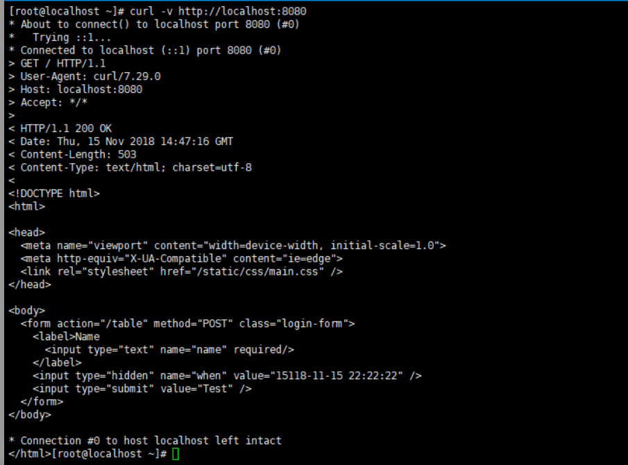
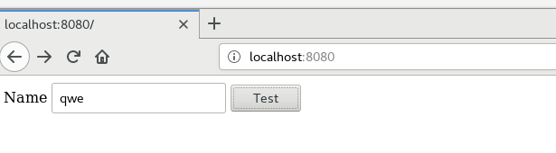
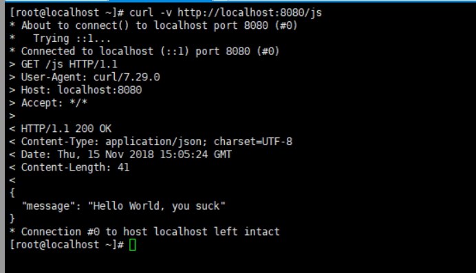
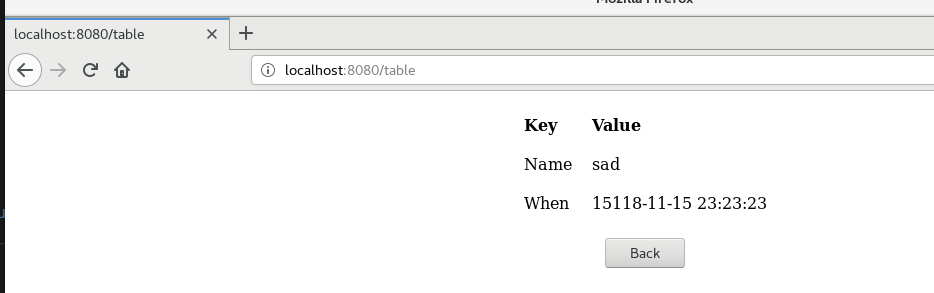
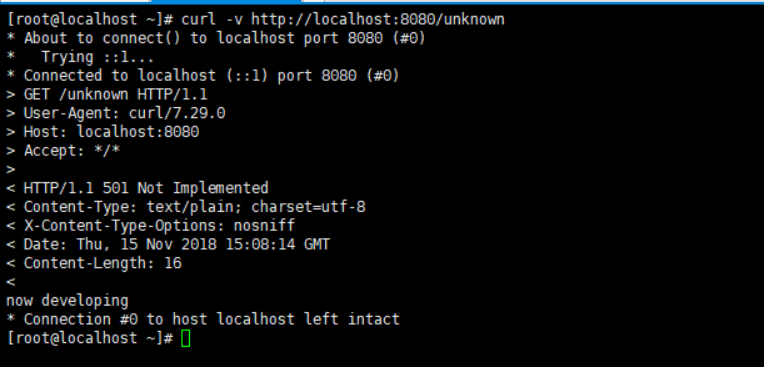

# 编程 web 应用程序 cloudgo-io

## 项目结构
1. service/js.go 
  返回JSON数据结构
  
2. service/server.go
  新建服务程序，建立路由表，处理GET请求和POST请求
3. service/table.go
  对POST请求处理，渲染静态html页面，返回用户名和时间
4. service/unknown.go
  对不存在的路径返回unknown
5. main.go
  启动程序
6. templates
  存放静态html
  
  其实每个功能的实现思路都是一样的，得到对应的路由路径，再分别交给不同的handler处理即可

## 支持静态文件服务
由对应的handler完成处理，这里就是最简单的往resposne里面写入index.html模板，返回resposne即可

## 支持简单 js 访问

## 提交表单，并输出一个表格
在点击上面的表单之后，向服务器的table路由发送请求，由table的handler处理这个请求，而且这个方法是POST的
利用mux.Router 做路由处理中间件，处理路由请求
将模板渲染数据后写入response，再返回，就完成了js请求服务器，并输出表单

##  对 /unknown 给出开发中的提示，返回码 5xx

