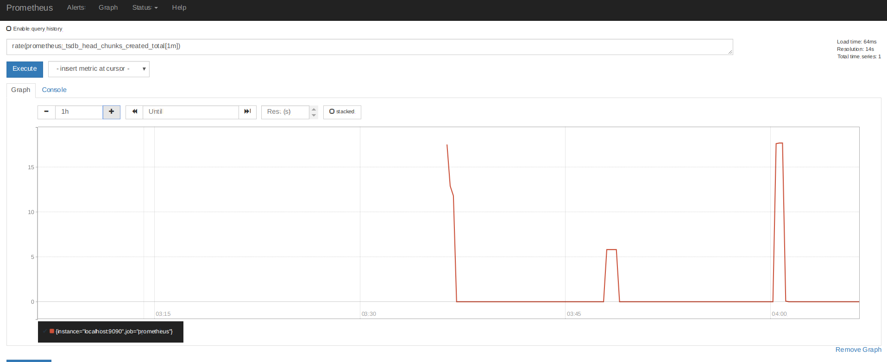
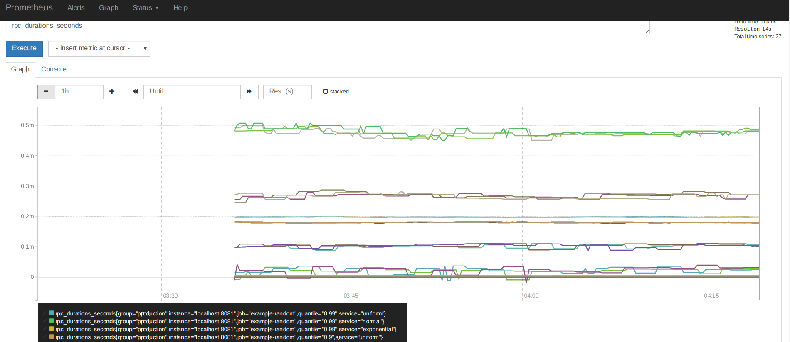

# prometheus 简介

## 什么是prometheus
prometheus 是一个开源的系统，用于监控和提示套件。 prometheus 于2016加入CNCF，作为第二个寄宿的项目，在kerbernetes 之后

## 特点
1. 一个有着被测量名字和键值对标识的时间序列数据的多重维度的数据模型
2. Promql， 一个可以提供这种维度特性的灵活的查询语言
3. 不依赖于分布式存储
4. 通过http来拉取模型来收集时间序列
5. 通过服务发现和静态配置来发现目标
6. 支持多节点图形化和仪表监控

## 组成部分
1. prometheus server 用于收集和存储序列化数据
2. 客户端库用于测量应用代码
3. 推送网关用于支持短生命周期的任务
4. alertmanager 处理提示


## 架构

prometheus 从被加了检测仪器的任务中收集测量数据，直接或间接的通过 用于 短期生命中期的任务push gateway。 它会存储所有提取的特征，根据规则运行代码来聚合和记录新的时间序列从已有的数据或者产生提示

## 优点
记录任何纯数字的时间序列
可靠，可以快速的诊断问题，每个 prometheus server 是独立的，不依赖于网络存储或其他远程服务。
## 缺点
如果你需要100%准确性，prometheus 可能做不到，例如对于每个请求的计费，因为收集的数据可能不会很详细和完整。

# 实践

## 下载和运行
[下载相应系统的prometheus](https://prometheus.io/download)
```
tar xvfz prometheus-*.tar.gz
cd prometheus-*
```
解压并进入目录

## 配置prometheus 并监控prometheus本身
prometheus 从监控的目标中通过抓取测量http 端点来收集数据。因为prometheus也会以同样的方式向外暴露自己的数据，所以它可以抓取和监控自己的健康。

配置prometheus.yml
```
global:
  scrape_interval:     15s # By default, scrape targets every 15 seconds.

  # Attach these labels to any time series or alerts when communicating with
  # external systems (federation, remote storage, Alertmanager).
  external_labels:
    monitor: 'codelab-monitor'

# A scrape configuration containing exactly one endpoint to scrape:
# Here it's Prometheus itself.
scrape_configs:
  # The job name is added as a label `job=<job_name>` to any timeseries scraped from this config.
  - job_name: 'prometheus'

    # Override the global default and scrape targets from this job every 5 seconds.
    scrape_interval: 5s

    static_configs:
      - targets: ['localhost:9090']
```


命令介绍
global 全局配置，作为特定配置没有情况下的默认配置，特定的配置可以覆盖全局配置，在单个任务下
scrape_interval 抓取时间间隔
external_labels 在与外界系统通信的时候将制定的label赋给时间序列或提示
scrape_configs 抓取配置仅仅包含抓取一个终端的信息
job_name 指定名字
static_configs 静态配置发现目标

## 启动prometheus
```
./prometheus --config.file=prometheus.yml
```
这时候访问，即可看见监视界面
[](localhost:9090)

## 使用表达式浏览器
进入 (http://localhost:9090/graph) 选择console，输入命令
```
prometheus_target_interval_length_seconds
```
这会返回不同的时间序列，所有的都有 prometheus_target_interval_length_seconds，但是有不同的label，这些标签指派不同的延迟百分比 

您也可以只查看百分比为0.99 的延迟
```
prometheus_target_interval_length_seconds{quantile="0.99"}
```

## 使用图形界面
[http://localhost:9090/graph](http://localhost:9090/graph)
以下命令会画出数据块每秒的产生速率
```
rate(prometheus_tsdb_head_chunks_created_total[1m])
``` 


## 监控其他目标
下载golang客户端，分别启动3个进程，在8080.8081,8082 端口，可以表明prometheus的集群监控能力
```
# Fetch the client library code and compile example.
git clone https://github.com/prometheus/client_golang.git
cd client_golang/examples/random
go get -d
go build

# Start 3 example targets in separate terminals:
./random -listen-address=:8080
./random -listen-address=:8081
./random -listen-address=:8082
```
可以在浏览器访问
[http://localhost:8080/metrics](http://localhost:8080/metrics)
[http://localhost:8081/metrics](http://localhost:8081/metrics)
[http://localhost:8082/metrics](http://localhost:8082/metrics)
查看服务是否启动

## 配置prometheus 监控启动的服务
在原来的prometheus.yml配置文件里加上如下指令
```
scrape_configs:
  - job_name:       'example-random'

    # Override the global default and scrape targets from this job every 5 seconds.
    scrape_interval: 5s

    static_configs:
      - targets: ['localhost:8080', 'localhost:8081']
        labels:
          group: 'production'

      - targets: ['localhost:8082']
        labels:
          group: 'canary'
```
上面指令加上了分组，比如8080,8081为一组，8082为一组，通过target指定监控目标

我们可以通过以下命令查看是否成功监控了服务
```
rpc_durations_seconds
```


## 为聚合抓取数据成为新的时间序列配置规则
聚合成千上万的的时间序列的查询会比较慢，为了让这种情况变得更有效，prometheus 允许您通过配置记录规则为新的时间序列预先记录表达式。
假设我们想记录每个服务实例在一个5分钟的窗口内，平均每个每个实例的RPC每秒中的次数，我们可以这样写(保留 job 和service 维度)

```
avg(rate(rpc_durations_seconds_count[5m])) by (job, service)
```
